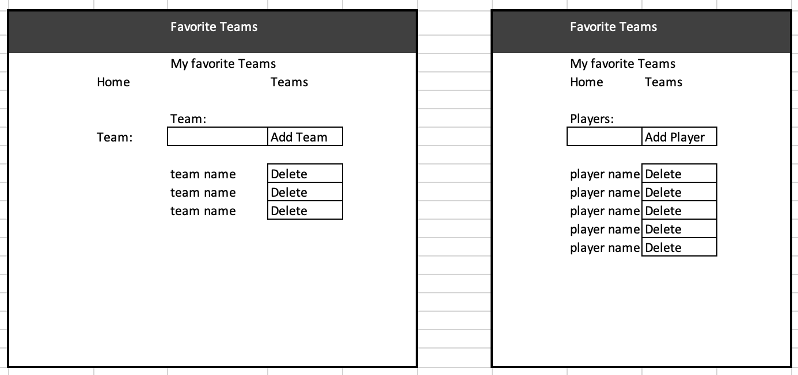

## Deere Project 4

This applicaiton will allow you to list your favorite baseball team(s) and player(s).  You may add or remove teams as the season progresses.  You may add or remove players as trades happen.

This is the backend portion of the applicaiton which defines the routes and uses Sequelize to update the database.  This is an Express application and serves JSON data only. There are no views. You can use Postman to test that the endpoints are working.  Each endpoint is prefaced with `/api`.

## BASIC FLOW
- Click on the navigation link to go to Favorite Team
- Enter the name of your favorite team and click the Add Team button
- click on the team name to go to the player page
- Enter the name of the player you wish to add and click the Add Player button
- You can remove a Player by clicking the Delete button after their name
- You can remove a Team by first removing all its Players, and then clicking the Delete button

```js
// server.js  Note: the auth and user routes were not implemented at this time.
app.use("/api/auth", require("./controllers/authController.js"));
app.use("/api/users", require("./controllers/usersController.js"));
app.use("/api/teams", require("./controllers/teamsController.js"));
```

## PROJECT LINKS

- [backend github repo](https://github.com/bradjd1/favorite-team-express-api-bknd)
- [frontend github repo](https://github.com/bradjd1/favorite-team-front-end)


<br>

## USER STORIES

- As a sports fan I want a way to list my favorite teams.
- As a sports fan I want a way to add new teams to my favorites list.
- As a team fan I want a way to list players on the team.
- As a team fan I want a way to add players to the team.

## WIRE FRAMES:
[`WIREFRAMES`](./planning/wireframes.png):



## TECHNOLOGIES USED

- Express:
- Sequelize
- Writing Code: Visual Studio Code
- Test Code: Postman
- Version Control: GitHub
- Deployment: Heroku

## NEXT STEPS / FUTURE FEATURES

- Set up user routes
- Set up authorization
- When you choose to delete a team which has players, the application could delete all the players for you, then delete the team.
- Add a Player detail page
- The original intent was to capture your favorite baseball teams and their players.  It could be used to capture your favorite teams from other sports as well.

## Set Up

1. Fork and clone this repo
1. `cd` into the folder and run `npm install`

1. Check out your `config/config.json` file. You'll need to create a database called `favteam_devl` (or feel free to rename the database) in pgAdmin or from any directory in the Terminal:

   ```
   createdb favteam_devl
   ```

1. Sequelize is included in the app. You have `User`, `Team`, and `Player` models. The `User` model was not incorporated at this time.  Run `npx sequelize db:migrate` to create the tables in your database.

1. Run `nodemon`.
1. Open Postman to confirm that your app is working on `localhost:3000/`.
